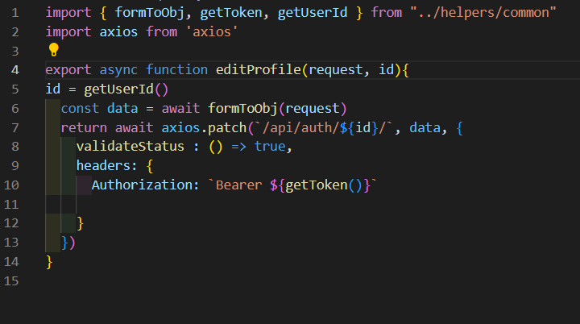

# TechFolio ReadMe

## Overview and Concept

TechFolio is the fourth and final project completed during my General Assembly course. It is a platform where developers can showcase their portfolios by uploading their projects. Other users and visitors of the site can view these projects and leave comments.

## Technical Requirements

You must:

* **Build a full-stack application** by making your own backend and your own front-end
* **Use a Python Django API** using Django REST Framework to serve your data from a Postgres database
* **Consume your API with a separate front-end** built with React
* **Be a complete product** which most likely means multiple relationships and CRUD functionality for at least a couple of models
* **Complex Functionality** like integrating a 3rd party API or using a particularly complex React Component would mean that the CRUD and multiple relationships requirement can be relaxed, speak to your instructor if you think this could be you.
* **Implement thoughtful user stories/wireframes** that are significant enough to help you know which features are core MVP and which you can cut
* **Have a visually impressive design** to kick your portfolio up a notch and have something to wow future clients & employers. **ALLOW** time for this.
* **Be deployed online** so it's publicly accessible.

---

## Necessary Deliverables

* A **working app** hosted on the internet
* A **link to your hosted working app** in the URL section of your Github repo
* A **git repository hosted on Github**, with a link to your hosted project, and frequent commits dating back to the _very beginning_ of the project
* **A `readme.md` file** with:
    * An embedded screenshot of the app
    * Explanations of the **technologies** used
    * A couple paragraphs about the **general approach you took**
    * **Installation instructions** for any dependencies
    * Link to your **user stories/wireframes** – sketches of major views / interfaces in your application
    * Link to your **pitch deck/presentation** – documentation of your wireframes, user stories, and proposed architecture
    * Descriptions of any **unsolved problems** or **major hurdles** you had to overcome

---
## Project Brief

The objective was to create a comprehensive full-stack application with a Python Django API using Django REST Framework, connected to a Postgres database, and a React-based front-end. The application should include multiple models with CRUD functionality, reflecting thoughtful user stories and wireframes to identify core MVP features. Prioritize an aesthetically impressive design to enhance your portfolio, allowing for a visually striking user interface. Additionally, allocate time for thorough testing and debugging. The final deliverable must be deployed online, ensuring public accessibility, showcasing skills in both back-end development and front-end design. This project serves as a showcase of abilities, demonstrating proficiency in creating a complete and polished web application.

Project Link: [TechFolio](https://techfolio.herokuapp.com/)

## Technologies Used:

- CSS
- JavaScript
- React
- Python
- Django
- Neon
- PostgreSQL
- Cloudinary
- Midjourney
- Figma
- Quick Database Diagrams
- Insomnia

## Installation:

1. Clone the repository: `git clone git@github.com:Jerrellbb/Techfoliohub.git`
2. Navigate to the project directory: `cd client`
3. Install dependencies using your preferred package manager: `npm install`
4. Start the development server: `npm run dev`

## Approach Taken

### Day 1: Planning

The first day began with planning. I initially had two ideas one being techFolio and the other involved a hobby of mine which is weight lifting but I wanted to save that for a later side project. Once the idea was chosen, I used Quick Database Diagrams to create my ERD to show the relationship between my models within my database. Next step for me was to use Figma to create a wireframe.

Although the image shows a landing page I later decided to not include it and just allow visitors to explore the site before signing in or registering.  
I then got started on my server side using Python and Django REST Framework. I started by creating models for each of my tables within my database and their respective views and urls.

### Day 2:

I continued working on my views and populating my models through day two as well as using Simple JWT for authorisation. Once they were created, I proceeded to use Insomnia to ensure that all of my endpoints were correct and being hit. 

### Day 3:

On day three I began on my client side using React, I started off by creating my components and loaders. I did this to ensure that I was able to display all the information that was needed within each component. I then added a nav with links to each component and a footer.

### Day 4:

Day four was the day to implement my actions  and get the functionality of my components working. I started with my login and register actions as login is needed for full CRUD functionality on my project's model. Once that was done I focused on my patch actions for my user model allowing for updating users allowing me to show all information on a single profile page. The update user was a must as when registering you only choose a username email and password when updating your profile it allows you to then add additional details such as an image, full name and social media links. The choice to keep the additional information out of the sign up process was to increase the users experience by not forcing them to add all information when having to register allowing for an easier and faster register process. Once this was done I focused on my CRUD functionality for the project’s and comments.

### Day 5:

Once the CRUD for all of my models were complete, I revisited each component. To make sure I was displaying everything I wanted, adding and taking out some things I may not have wanted to display on each component. Doing this would allow me to then focus on how I wanted to style everything.

### Day 6:

Day six was solely focused on styling. I started with my hero image which I used Midjourney to create. I then moved to CSS first styling my forms and then moving on to each component one by one.

## Key Learnings:

- Learned Python and Django within a week.
- Explored Django REST Framework and I felt it was a lot easier than using React and Express for the server side,   especially with things like generic views which really helps break down the workload.
- Found Django's generic views helpful in reducing workload.

## Wins:

- Successfully learned Python and Django within a week.
- Proficiency in backend development.

## Challenges:

- Faced issues with actions during project creation and update.
- Had to find workarounds for form data transmission.
- Using simple JWT for authorization I was receiving an access token which was different from what I received when using JWT with React and Express. I needed to figure out why my authentication wasn’t working on the front end.

## Future Improvements:

- Allow users to upload multiple images for projects.
- Implement a slideshow for project images.

## Bugs:

- Thoroughly tested before deployment, no known bugs.

